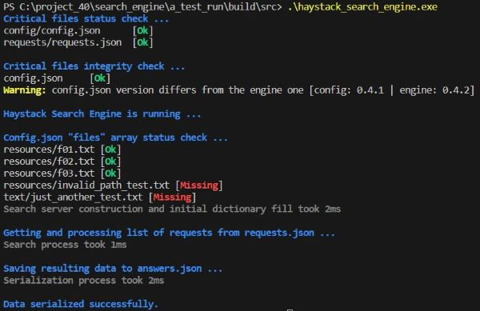

<h1 align="center">Haystack Search Engine</h1>

<h3 align="center">Handcrafted since ... well ... the moment I lost a needle</h3>

<h2 align="center"><a href="https://replit.com/@HanSolo3/HaystackSearchEngine" target="_blank">A haystack to test! | Replit demo</a></h2>

## Description - Описание проекта

Данный проект является итоговым в рамках курса <a href="https://skillbox.ru/course/profession-c-plus-plus/" target="blank">«Профессия: Разработчик на C++ с нуля»</a>, представленного на онлайн-платформе Skillbox.

Разработанный поисковый движок даёт возможность на абстрактном локальном корпоративном портале находить документы в соответствии с поисковыми запросами и формировать список найденных материалов, учитывая их релевантность.

В процессе работы над проектом был получен опыт в построении поисковых индексов, работе с конфигурационными файлами, а также написании модульных тестов для проекта.

Поисковый движок представляет из себя консольное приложение, использующее конфигурационные JSON-файлы.

Данную реализацию в дальнейшем можно использовать в Web-версии поискового движка.

## Technology stack - Стек используемых технологий

- **C++17** - многопоточность, работа с динамической памятью, работа с файловой системой, использование STL
- CMake
- Mingw-w64 software development environment
- Git
- [JSON for Modern C++](https://github.com/nlohmann/json/releases) by [Niels Lohmann](https://nlohmann.me)

## Details - Описание функционала проекта

### Обязательные требования

Для работы поискового движка требуется обязательное наличие конфигурационных файлов:

- config/config.json
- requests/requests.json

А также документов, по которым будет осуществляться поиск: 

- resources/text_file_1.txt *
- resources/text_file_2.txt *
- resources/text_file_3.txt *
- ...

*Имена файлов даны для примера. Актуальные имена указываются в файле *config/config.json* в поле *"files"*.

### Принцип работы

1. Пользователь указывает в файле *config/config.json* имена документов, внутри которых будет осуществляться поиск. Далее в файле *requests/requests.json* задаются запросы для поиска.

2. Поисковый движок в процессе запуска, используя многопоточность, анализирует каждый документ в отдельной нити исполнения и создаёт индекс содержимого указанных документов.

3. Запросы анализируются в режиме многопоточности и при помощи индекса содержимого документов, находятся те, в которых встречаются перечисленные запросы.

4. Результаты поиска, ограниченные количеством, указанным в конфигурационном файле *config/config.json* в поле *"max_responses"*, сортируются по степени релевантности и записываются в файл *answers/answers.json*.

### Детальное описание конфигурационных файлов проекта

**config.json**  

*"config"* - обязательное поле, при отсутствии которого, будет выброшено исключение и прекращена работа приложения. Также исключение будет выброшено при отсутствии самого файла *config/config.json*.

- *"name"* - название поискового движка. Отображается при запуске приложения.
- *"version"* - версия поискового движка. При несоответствии значения этого поля с текущей версией приложения, выводится предупреждение. Для демонстрации результата, в тестовых конфигурационных файлах указаны разные версии.
- *"max_responses"* - максимальное количество результатов поиска на один запрос в файле ответов.

*"files"* - список путей к документам, по которым будет осуществляться поиск. В случае отсутствия одного из файлов, его статус отображается как [Missing]. Каждый документ в этом списке может содержать не более **1000** слов с максимальной длиной каждого не более **100** символов. В случае несоответствия требованиям, количество прочитанных слов, принудительно ограничивается указанным выше значением, а слова, превышающие по своей длине **100** символов, игнорируются. Слова должны состоять из строчных латинских букв и могут быть разделены одним или более пробелами. 

**requests.json**  

Файл *requests/requests.json* содержит список поисковых запросов.

*"requests"* - содержит список запросов, которые будут обработаны поисковым движком. Максимальный размер списка: **1000** строк. Допустимое количество слов в строке запроса: от **1** до **10**. Слова должны состоять из строчных латинских букв и могут быть разделены одним или более пробелами. В случае превышения допустимого размера списка, текущий рабочий размер явно ограничивается **1000** элементами, а профицитные элементы добавляются в рабочий список в случае несоответствия требованиям к размеру строки запроса элементов из актуального на данный момент списка строк.

**answers.json**  

Файл *answers/answers.json* содержит результаты работы поискового движка. В случае отсутствия файла, он создаётся при завершении работы движка. В случае наличия файла, его содержимое перезаписывается.

*"answers"* - содержит ответы на поисковые запросы.

- *"request0001 … n"* - идентификатор запроса, который начинается с **1** и далее формируется автоматически, увеличиваясь по порядку нахождения запроса в поле *requests* файла *requests/requests.json*.
  - *"result"* - принимает значение *true* в случае наличия одного и более ответов, и значение *false* иначе. Во втором случае другие поля в данном ответе отсутствуют.
  - *"relevance"* - в случае нахождения более одного ответа, содержит список строк, содержащих пары *"docid"* - *"rank"*. Ответ оформлен в виде строк с целью преодоления ограничения библиотеки [JSON for Modern C++](https://github.com/nlohmann/json/releases) в отношении контейнеров *multimap*, а также для удобства возможного последующего парсинга результатов поиска.

    *"docid"* - идентификатор документа, в котором
    найден ответ на запрос. Начинается с **0** и формируется автоматически при индексации всех документов, исходя из порядка, в котором документы расположены в поле *"files"* файла *config/config.json*.
    
    *"rank"* - поисковый рейтинг ответа. Располагается в порядке уменьшения и показывает, насколько документ подходит для заданного запроса.

### Классы проекта и их интерфейсы

пространство имён **Exceptions** - *exceptions.h*
- **GeneralException** - абстрактная базовая структура исключения.
- **FileException** - производная структура исключения отсутствия конфигурационных файлов.
- **ConfigException** - производная структура исключения невозможности открыть/создать ключевые файлы, а также качественного их содержимого.

пространство имён **Converters** - *converters.h*
- **ConverterJSON** - класс функционала сериализации и десериализации данных формата JSON.
  - ConverterJSON(...) - конструктор класса, принимающий в качестве аргумента текущую версию движка, указанную в константе ENGINE_VERSION файла *main.cpp*.
  - getTextDocuments() - возвращает список путей к файлам, перечисленных в *config/config.json*.
  - getRequests() - возвращает список запросов из файла *requests/requests.json*.
  - putAnswers(...) - принимает в качестве аргумента результат возврата метода SearchServer::search(...). Размещает в файле *answers/answers.json* результат поисковых запросов.

пространство имён **Servers** - *servers.h* и *converters.h*
- **RelativeIndex** - структура рейтинга ответа, содержащая поля *"doc_id"* - идентификатор документа и *"rank"* - поисковый рейтинг ответа.
- **Entry** - структура поискового индекса, содержащая поля *"doc_id"* - идентификатор документа и *"count"* - количество вхождений слова в рамках *doc_id* документа.
- **SearchServer** - класс функционала поискового движка.
  - SearchServer(...) - конструктор класса, принимающий в качестве аргументов результат возврата метода ConverterJSON::getTextDocuments() и объект таймера для оценки временных затрат текущей задачи. Выполняет первичное заполнение частотного словаря, создавая тем самым инвертированный индекс.
  - fillOutDocumentBase(...) - принимает в качестве аргумента результат возврата метода ConverterJSON::getTextDocuments(). Функционал ограничен только заполнением частотного словаря. Повторный вызов метода приводит к очищению словаря и его новому заполнению.
  - search(...) - принимает в качестве аргументов результат возврата метода ConverterJSON::getRequests() и объект таймера для оценки временных затрат текущей задачи. Возвращает результат поисковых запросов.

пространство имён **Telemetry** - *telemetry.h*
- **Timer** - класс таймера для оценки временных затрат функционала поискового движка.
  - Timer(...) - конструктор класса, принимающий в качестве аргумента комментарий с описанием процесса.
  - check() - вывод показаний таймера.

## Unit testing - Модульное тестирование

Для упрощения документирования и дальнейшего сопровождения проекта, в нём реализовано модульное тестирование при помощи фреймворка GoogleTest.

Набор тестов выполнен в виде отдельного консольного приложения и находится в каталоге *tests*.

Тестами покрывается функционал создания инвертированного индекса, а также процесс поиска и формирования результатов поисковых запросов.

## Launch - Локальный запуск проекта

Для сборки самого проекта, а также модульных тестов, расположенных в папке *tests*, используется программное средство автоматизации сборки CMake.

В головном файле CMakeLists.txt присутствует опция ВКЛ/ВЫКЛ сборки тестов:

- option(BUILD_TESTS "Build tests" ON) - по умолчанию включена (ON)

В результате сборки появляются два исполняемых файла:

- build/src/haystack_search_engine.exe
- build/tests/haystack_engine_tests.exe

Файлы для тестового запуска поискового движка находятся в прилагаемом к проекту архиве *config_files.zip*. Его необходимо распаковать в директориях с указанными выше исполняемыми файлами проекта и тестов.

В директориях с исполняемыми файлами проекта и тестов должны быть созданы каталоги со следующими названиями:
- answers
- config
- requests
- resources

Указанные каталоги должны содержать описанные выше в данном документе конфигурационные файлы.

В директории *resources* тестового архива *config_files.zip* находятся три файла для альтернативного запуска поискового движка: *file001_969_words.txt, file002_936_words.txt, file003_470_words.txt*. В случае необходимости, их имена следует указать в файле *config/config.json*, а в файле *requests/requests.json* заменить, учитывая содержимое перечисленных текстовых файлов, поисковые запросы.

Библиотека [JSON for Modern C++](https://github.com/nlohmann/json/releases) приложена к проекту в виде единственного заголовочного файла *include/json.hpp*. В указанную библиотеку, для соответствия вывода условиям ТЗ, внесены изменения - строки, начиная с 18748 с комментарием YMS.

**Пример сборки и запуска приложения из консоли:**

- cmake -S. -B build -G "MinGW Makefiles"

- cmake --build build

- cd build/src для проекта или cd build/tests для тестов

- распаковать в указанных директориях архив *config_files.zip*

Для запуска приложения в директории build/src: *.\haystack_search_engine.exe*

Для тестов в директории build/tests: *ctest* или *.\haystack_engine_tests.exe*

В приложении реализован цветной вывод в консоль при использовании WindowsPowerShell.

## Acknowledgments - Благодарности

Хотелось бы поблагодарить всю команду онлайн-платформы [Skillbox](https://skillbox.ru/) за создание данного учебного курса. Процесс обучения был непростым, но от этого интересным и запоминающимся.

Персональную благодарность хотел бы выразить куратору курса Александру Масюкову за поддержание мотивации в непростые моменты, а также Владиславу Турбанову за уникальный подход к изложению материала курса!
